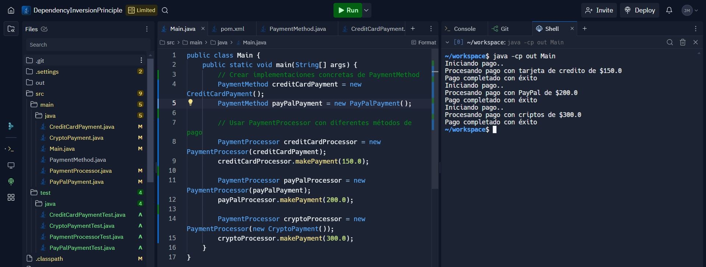

# README

## Principio de Inversión de Dependencias (DIP)

El Principio de Inversión de Dependencias (DIP) establece que:
1. Los módulos de alto nivel no deben depender de los módulos de bajo nivel. Ambos deben depender de abstracciones.
2. Las abstracciones no deben depender de los detalles. Los detalles deben depender de las abstracciones.

## Problemas Detectados Antes de la Refactorización

Inicialmente, la clase `PaymentProcessor` dependía directamente de la implementación concreta `CreditCardPayment`. Esto causaba los siguientes problemas:
- **Falta de Flexibilidad:** Agregar nuevos métodos de pago, como PayPal o criptomonedas, requería modificar el código de `PaymentProcessor`.
- **Acoplamiento Extremo:** La clase `PaymentProcessor` estaba fuertemente acoplada a la implementación concreta, dificultando su extensión y pruebas.
- **Dificultad en Pruebas Unitarias:** No se podían realizar pruebas de `PaymentProcessor` sin incluir `CreditCardPayment`.

## Cómo se Aplicó el DIP en la Refactorización

1. **Introducción de una Abstracción:**
   Se creó una interfaz `PaymentMethod` que define el contrato para todos los métodos de pago. `PaymentProcessor` ahora depende de esta interfaz en lugar de una implementación concreta.

2. **Inyección de Dependencias:**
   `PaymentProcessor` recibe una implementación de `PaymentMethod` a través de su constructor. Esto desacopla la clase de alto nivel de las clases concretas.

3. **Implementaciones Flexibles:**
   Se añadieron implementaciones específicas para `CreditCardPayment`, `PayPalPayment` y `CryptoPayment`, las cuales implementan la interfaz `PaymentMethod`.

## Problemas que Resolvió la Refactorización

- **Reducción del Acoplamiento:** Ahora `PaymentProcessor` depende de la abstracción `PaymentMethod`, no de implementaciones concretas.
- **Extensibilidad:** Se pueden agregar nuevos métodos de pago sin modificar el código de `PaymentProcessor`.
- **Pruebas Simples:** `PaymentProcessor` puede ser probado de manera aislada utilizando implementaciones simuladas (mocks) de `PaymentMethod`.
- 

## Conclusión

La aplicación del Principio de Inversión de Dependencias ha permitido que el sistema sea más flexible, mantenible y escalable. Este diseño asegura que los módulos de alto nivel no se vean afectados por los cambios en los detalles de implementación, facilitando futuras ampliaciones y mejorando la calidad del código.
